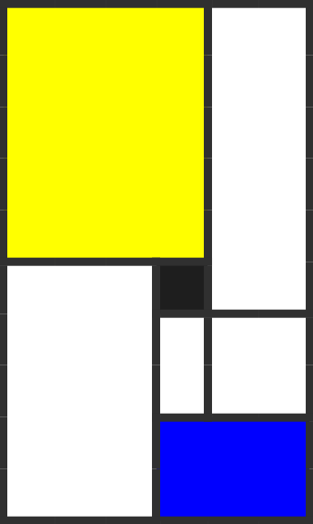

# Mondrian Clock

A clock cycling through 60 states per minute, each a subset sum of {1, 2, 4, 6, 12, 15, 20}.

These weights cover [Farey sequence](https://en.wikipedia.org/wiki/Farey_sequence) $F_6$ exactly.

Period: $2^{30} \times 3^{16}$ min ≈ 88 billion years

[](https://hraj.si/now)

**[▶ hraj.si/now](https://hraj.si/now)** · **[Wallpaper Engine](https://steamcommunity.com/sharedfiles/filedetails/?id=3125524524)**

## How It Works

The clock face consists of 7 rectangular cells with areas 1, 2, 4, 6, 12, 15, and 20 units. Each second displays a unique combination of cells that sum to that second (0–59). The specific combination chosen each second depends on the minute number (k), creating a unique 60-pattern sequence for every minute in the period.

## Project Structure

- `web/` - Clock webpage (HTML/CSS/JS)
- `terminal/` - C terminal implementation
- `inverse/` - Python video analyzer (reconstructs clock origin from video recordings)

## Terminal Clock

The `terminal/` directory contains a lightweight C implementation of the clock for terminal display. It supports both ASCII and Unicode modes, and includes inverse mode to decode frames.

See [terminal/README.md](terminal/README.md) for full documentation.

### Quick Start

```bash
cd terminal
make
./now              # Live clock
./now -a -d        # ASCII with 4-color distinction
```

### Round-trip Test

```bash
./now -a -s -n 60 | ./now -i
# Output: 1970-01-01T00:00:00Z
```

## Inverse Tool (Video)

The `inverse/` directory contains a Python tool that analyzes a 60-second video recording of the clock and determines when the clock was originally started.

### Installation

```bash
cd inverse
python3 -m venv venv
source venv/bin/activate
pip install -r requirements.txt
```

### Usage

```bash
python main.py video.MOV
```

Options:
- `--timestamp "YYYY-MM-DD HH:MM:SS"` - Override video timestamp
- `--tolerance N` - Color detection tolerance (default: 80)
- `--verbose` - Show detailed output
- `--visualize` - Generate debug video

### Example Output

```
Video timestamp: 2026-01-03 11:55:00 (from exiftool)

Analyzing video...
Extracted 60 seconds of cell observations

Searching for valid clock state...
Found valid state! (60/60 seconds matched)
  Video started at second: 0
  Minute identifier (k): 29457295

==================================================
RESULT
==================================================

Elapsed time since clock started:
  1,767,437,700 seconds
  (29,457,295 minutes, 20,456.5 days, 56.0 years)

Clock origin (UTC):
  1970-01-01 00:00:00

Note: The clock period is 46,221,064,723,759,104 minutes
      (>88 billion years)
```

### How Inversion Works

1. **Video Analysis**: Extract frames and detect which cells are visible each second
2. **Rotation Search**: Try all 60 possible starting seconds to align observations
3. **Bit Extraction**: Reconstruct the minute identifier (k) from observed patterns
4. **Origin Calculation**: Subtract k minutes from video timestamp

### Detection Features

- **Hybrid detection**: Simple edge-based detection for quality videos, Hough-based corner tracking for tilted/moving videos
- **Color-independent**: Works with any color scheme (standard colors, monochrome red, etc.)
- **Sum-based seconds**: Cells shown at second S always sum to S, making detection FPS-independent
- **Error correction**: Can fix single-cell detection errors using valid combination lookup

## URL Parameters

The clock webpage accepts URL parameters:

- `origin` - Custom epoch (ISO 8601 format, e.g., `2000-01-01T00:00:00Z`)
- `offset` - Year offset from origin
- `period` - Time unit in minutes (1=minutes, 60=hours, 3600=days)
- `mod` - Modulus for display (default: 60)

Example: `https://hraj.si/now?origin=2000-01-01T00:00:00Z`

## Click Interaction

Click the clock to cycle through display modes:
- **Minutes** (default): Pattern changes every second
- **Hours**: Pattern changes every minute
- **Days**: Pattern changes every hour

## Technical Details

### Permutation Function

The `perm(k)` function maps a minute number to 60 display indices:
- 20 seconds have 1 option (deterministic)
- 18 seconds have 2 options (18 bits)
- 16 seconds have 3 options (~25 bits)
- 6 seconds have 4 options (12 bits)

Total entropy: ~55 bits per minute, sufficient for the 46-quadrillion-minute period.

### Dependencies

- **Web**: Pure HTML/CSS/JavaScript, no dependencies
- **Inverse tool**: Python 3, OpenCV, NumPy, ffprobe/exiftool

## License

[CC BY-NC 4.0](https://creativecommons.org/licenses/by-nc/4.0/) - Non-commercial use only
